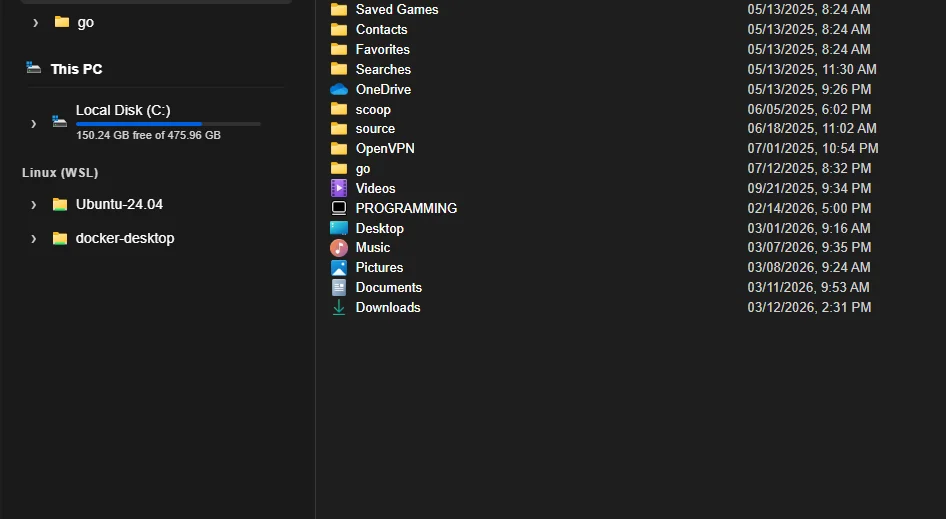
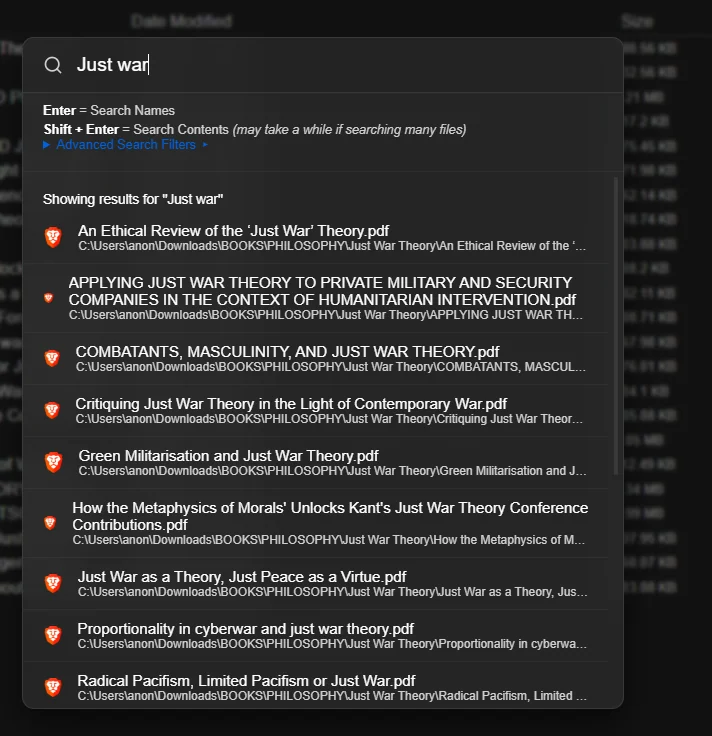
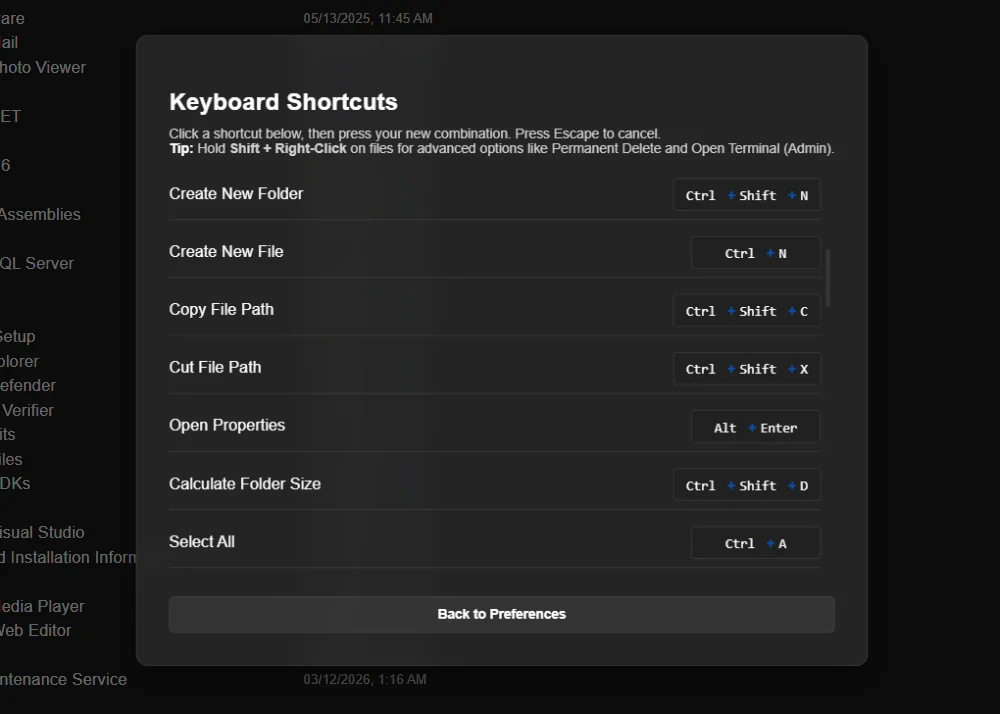
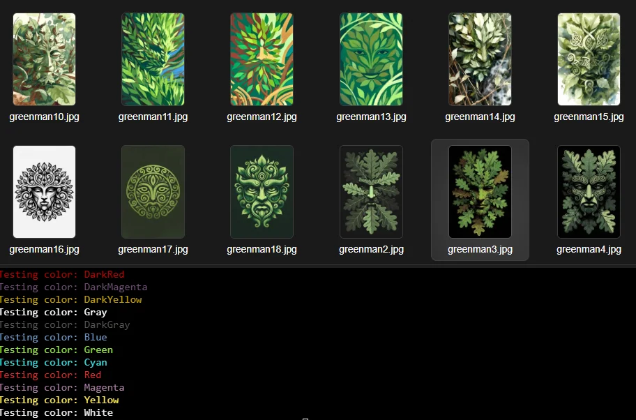
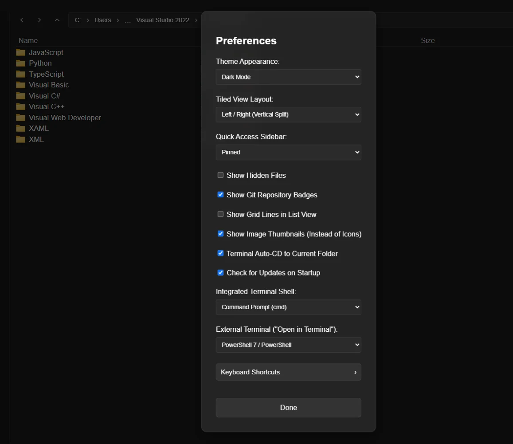
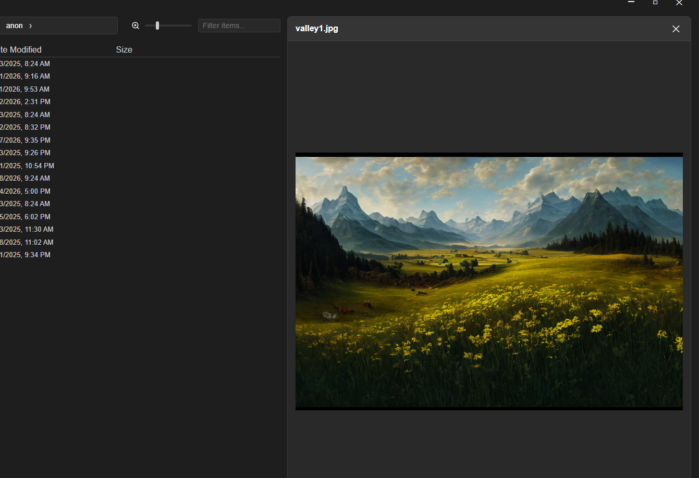
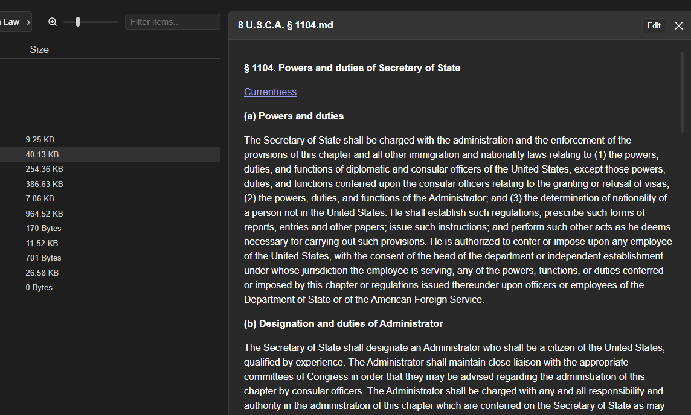
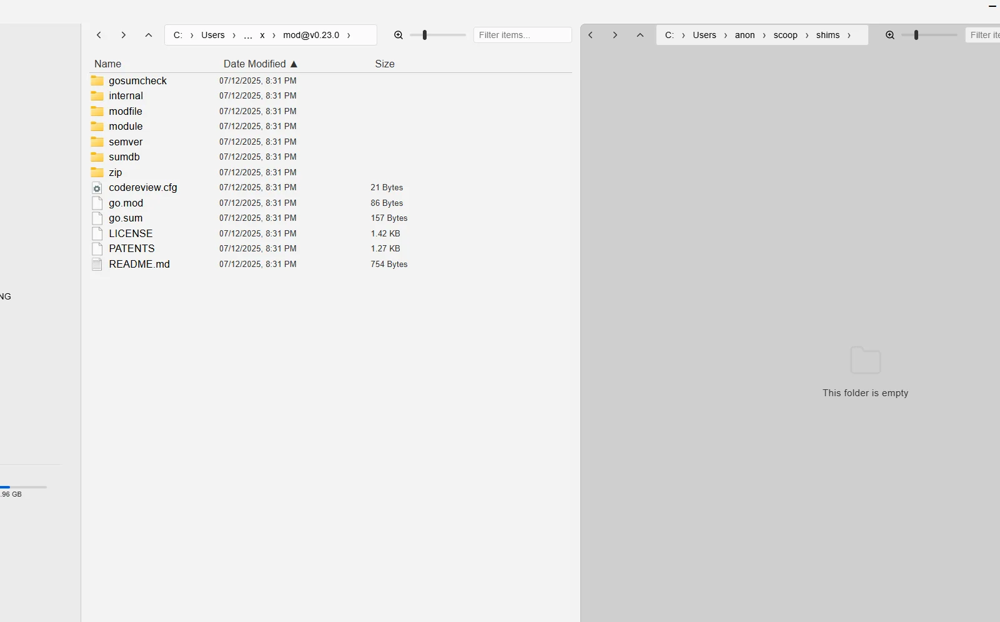

# Minimal Explorer

Minimal Explorer is a fast, highly performant Windows Explorer replacement built for Windows 11. Engineered with a lightweight Rust backend, it prioritizes speed and keyboard-centric workflows. 

Because Windows Explorer is deeply integrated into Windows 10/11, it is not practically possible to completely replace it natively. However, this file explorer serves as an extremely capable alternative power-user tool. With minor adjustments (mostly removing Windows-specific APIs), it could easily be ported to Linux.


[](https://github.com/deminimis/MinimalExplorer/releases)


<p align="center">
  
</p>


## Features

- **Fast Architecture:** Rust backend with native-like performance and minimal RAM usage. Zero-copy asynchronous file loading for massive directories.
- **Dual-Pane & Tabbed Interface:** Manage files side-by-side with horizontal or vertical split views, or open multiple directories in background tabs.
- **Integrated Terminal:** Built-in drop-down terminal (`Ctrl + \``) powered by xterm.js. Supports PowerShell, CMD, or custom shells (like WSL). It automatically syncs to your current working directory.
- **Advanced Deep Search:** Quickly filter for files by name, or use the Command Palette to search by file contents, extension, size, and modification date.
- **Native Archive Management:** Compress files to `.zip` (with configurable compression levels) or extract archives directly within the UI without third-party software.
- **Rich File Previews:** Instantly preview images, PDFs, raw text, and Markdown files (rendered securely) right inside the explorer pane.
- **Quick Access Sidebar:** Pin favorite folders for quick access, alongside automatic detection and mounting of WSL (Linux) distributions.
- **Command Palette & Custom Hotkeys:** A VS Code-style command palette (`Ctrl+Shift+P` or `>`) for quick actions, jumping to recent folders, and running operations. Almost all hotkeys are completely customizable.
- **Modern UI:** Custom-drawn titlebars, grid/list toggle modes, auto-calculating folder sizes, and right-click context menus with Acrylic-style blur effects. Supports Light, Dark, and System Auto themes.

<table align="center">
  <tr>
    <td width="50%" align="center">
      <b>Instant Search</b><br>
      
    </td>
    <td width="50%" align="center">
      <b>Power User Hotkeys</b><br>
      
    </td>
  </tr>
  <tr>
    <td width="50%" align="center">
      <b>Integrated Terminal</b><br>
      
    </td>
    <td width="50%" align="center">
      <b>Deep Customization</b><br>
      
    </td>
  </tr>
  <tr>
    <td width="50%" align="center">
      <b>Integrated Terminal</b><br>
      
    </td>
    <td width="50%" align="center">
      <b>Deep Customization</b><br>
      
    </td>
  </tr>
</table>

<p align="center">
  <b>Light & Dark Mode Support</b><br>
  
</p>


## Configuration

Access the **Preferences** menu (`⚙ Preferences` or via the Command Palette) to adjust the application to your liking:

- **Theme:** Force Dark Mode, Light Mode, or respect System Auto.
- **Layout:** Switch between vertical and horizontal split panes.
- **Terminal Shell:** Choose between PowerShell, Command Prompt, or specify a custom path (e.g., `wsl`, `bash`, `wt.exe`).
- **Thumbnails:** Toggle image thumbnails on or off for better performance.
- **Hotkeys:** Rebind almost every action (Copy, Paste, New Tab, Open Search, etc.) to your preferred keystrokes.
- **Hidden Files & Git Badges:** Toggle visibility for hidden items and Git repository status badges.

## Development & Building

### Prerequisites

Before you begin, ensure you have the following installed:
- [Node.js](https://nodejs.org/) (v18 or higher)
- [Rust](https://www.rust-lang.org/tools/install) (Ensure C++ Build Tools are installed via the Visual Studio Installer)
- [Git](https://git-scm.com/)

### Installation

1. **Clone the repository:**
   ```bash
   git clone [https://github.com/yourusername/minimal-explorer.git](https://github.com/yourusername/minimal-explorer.git)
   cd minimal-explorer
2. **Install Dependencies:** npm install
3. **Run in dev mode:** npm run tauri dev